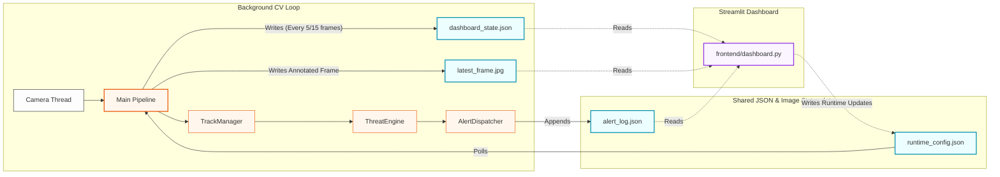

# Product Requirements Document (PRD)

## 1. Product Overview
**Product Name:** Women Safety Product — Edge AI Real-Time Monitoring System  
**Product Vision:** To provide a robust, production-grade, and self-contained AI monitoring system capable of accurately detecting potential threats against women in real time. The system acts as a smart surveillance layer that assesses situations on-the-fly and deploys alerts seamlessly, all without requiring an active cloud server for inference.

## 2. Problem Statement
Public and isolated spaces often lack proactive security measures. Existing camera systems are passive (recording for post-incident review) rather than active (detecting and intervening in real-time). Cloud-based AI solutions often suffer from latency, require high-bandwidth continuous connections, and involve privacy concerns about streaming video off-site. A local, Edge AI tool is missing that can detect tracking, encirclement, and sudden physical violence (rushing) interactively.

## 3. Target Audience & Personas
- **Primary Users:** Security personnel, campus safety teams, and residential watchmen monitoring localized CCTV feeds.
- **System Administrators:** IT teams tasked with setting up, tuning, and deploying offline security nodes on low-cost hardware (e.g., standard laptops, Jetson Nano).
- **Stakeholders:** Institutions and individuals looking for proactive emergency response integration.

## 4. Scope and Features

### 4.1 In-Scope (Current Implementation)
- **Computer Vision Pipeline:** Real-time object detection (persons) using YOLOv8n and multi-object tracking via BoT-SORT.
- **Threat Engine Strategy:** Action/intention understanding via 12 spatial-temporal tracking features (speed, proximity, encirclement, velocity-toward, isolation). Uses a hybrid XGBoost & heuristic behavior blend.
- **Streamlit Dashboard Engine:** 4-Tab dashboard for configuration, live feed view, runtime stats monitoring, and alert logs.
- **Trigger/Alert Systems:** Automated alerting across channels including auditory alarms and background (async) email notifications containing snapshot evidence and coordinates.
- **Hardware Agnosticism:** Works dynamically on CPU without GPU constraints using auto frame-skip tuning for adaptive performance maintenance (targets 25-40 FPS threshold).
- **Location Context:** Extrapolates immediate coordinates via IP-API waterfall / Google Maps bridging.

### 4.2 Out-of-Scope (Future Roadmap)
- Hardware GPS module integrations (NMEA serial).
- Parallel multi-camera monitoring under a unified pipeline.
- Instant messaging integrations (WhatsApp/Telegram hooks).
- Cloud-native streaming (WebRTC).

## 5. Functional Requirements (FR)

| ID | Requirement | Description |
|---|---|---|
| **FR-01** | **Person Detection & Tracking** | The system must be able to recognize human subjects and persistently track their identities within a frame using YOLOv8n and BoT-SORT. |
| **FR-02** | **Threat Scoring** | The system must calculate a live threat score normalized between 0-1 for individuals/groups based on kinematics (e.g. following, gathering, rushing). |
| **FR-03** | **Threat Levels** | The system must map scores to three severity tiers: LOW (>0.35), MEDIUM (>0.60), and HIGH (>0.80). |
| **FR-04** | **Persistence Gating** | Behaviors must persist for a threshold (e.g., 15 frames) before a threat condition escalation triggers (prevents false positive noise). |
| **FR-05** | **Alerting** | Triggered High/Medium threats must independently dispatch emails (containing frame snapshots) and sound auditory system alarms without blocking the inference loop. |
| **FR-06** | **Live Dashboard** | An accompanying graphical dashboard must render real-time pipeline telemetry, runtime config sliders, and an alert history log. |

## 6. Non-Functional Requirements (NFR)

| ID | Requirement | Protocol Standard |
|---|---|---|
| **NFR-01** | **Performance Constraints** | The pipeline module must guarantee >= 25 FPS runtime safely resting on a standard CPU node. |
| **NFR-02** | **Latency & Optimization** | Average inference time per frame optimally targeting ~35ms with fallback optimization using ONNX exports (~22ms). |
| **NFR-03** | **Modularity** | Configurations must be dynamically reloadable (via `.json` state files) without having to reboot the primary camera threading loop. |
| **NFR-04** | **Accuracy Thresholds** | Synthetic tests should map towards ROC-AUC ~ 0.97 and average precision (AP) ~ 0.96. |

## 7. System Architecture

## 8. Development Roadmap (Next Steps)
- **Phase 1.1:** Finalize Jetson Nano / TensorRT configurations for localized edge deployments.
- **Phase 1.2:** Introduce active learning logic to easily re-label uncertain frames and pipe them back to dataset pools.
- **Phase 2.0:** Extend alerting logic. Add direct webhook notifications to push to emergency Telegram or WhatsApp numbers dynamically based on threat index.
- **Phase 2.1:** Enable concurrent camera inputs (threading N-RTSP camera arrays) per dashboard unit.
