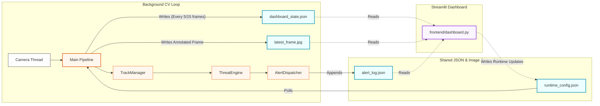

# 🛡️ Women Safety Product — Edge AI Real-Time Monitoring System

A production-grade, modular Python application for real-time person detection,
threat assessment, and emergency alerting — designed to run at **25–40+ FPS on a
standard laptop CPU** with zero cloud dependency.

---

## Table of Contents

1. [Architecture](#architecture)
2. [Quick Start](#quick-start)
3. [Full Pipeline](#full-pipeline)
4. [Configuration Reference](#configuration-reference)
5. [Training the Threat Model](#training-the-threat-model)
6. [ONNX Export & Acceleration](#onnx-export--acceleration)
7. [Streamlit Dashboard](#streamlit-dashboard)
8. [Alert Channels](#alert-channels)
9. [Running Tests](#running-tests)
10. [Performance Tuning](#performance-tuning)
11. [Project Structure](#project-structure)
12. [Development Roadmap](#development-roadmap)

---

## Architecture



### Component responsibilities

| Module | Role |
|---|---|
| `core/camera.py` | Thread-safe `VideoCapture`, daemon reader, exponential back-off auto-reconnect |
| `core/detector.py` | YOLOv8n inference + BoT-SORT tracking, person-only filter, warm-up pass |
| `core/tracker.py` | `TrackManager` — per-track history deque, stale pruning, alert cooldown resets |
| `core/features.py` | 12 spatial/temporal features per track: speed, proximity, encirclement, velocity-toward, etc. |
| `core/threat.py` | `ThreatEngine` — XGBoost + heuristic hybrid, sustained-frame gating, 3 alert levels |
| `utils/alerts.py` | `AlertDispatcher` — email (async thread), sound, in-memory log, per-track cooldown |
| `utils/location.py` | `LocationProvider` — Google Maps → ip-api waterfall, background refresh, `LocationFix` |
| `utils/performance.py` | `PerformanceMonitor` (FPS, p95 latency) + `FrameSkipTuner` (adaptive skip controller) |
| `utils/onnx_export.py` | YOLO → ONNX export, XGBoost → ONNX, OnnxRuntime verify + benchmark |
| `frontend/dashboard.py` | 4-tab Streamlit: Live Feed, Alert Log, Config, Stats |
| `scripts/train_threat_model.py` | XGBoost training — 7 synthetic scenarios + real CSV merge |

---

## Quick Start

```bash
# 1. Clone / unzip the project
cd women-safety-product

# 2. Create a virtual environment
python -m venv .venv
source .venv/bin/activate          # Windows: .venv\Scripts\activate

# 3. Install dependencies
pip install -r requirements.txt

# 4. Configure (edit .env — minimum: set CAMERA_SOURCE)
#    Default .env already works with webcam index 0

# 5. Run
python main.py                     # webcam + OpenCV window

# 6. Run headless (SSH / server)
python main.py --no-display

# 7. Run with dashboard
python main.py --dashboard         # opens Streamlit on :8501

# 8. Run on a video file
python main.py --source path/to/video.mp4
```

### Controls (OpenCV window)

| Key | Action |
|---|---|
| `q` | Quit gracefully |
| `s` | Save annotated snapshot to `data/` |
| `p` | Pause / resume |
| `+` / `=` | Increase frame skip (reduce CPU load) |
| `-` | Decrease frame skip (improve quality) |

---

## Full Pipeline

### Day 1 — Camera + Detection

```bash
python main.py --source 0 --skip 0
```

Starts YOLOv8n with BoT-SORT tracking. `yolov8n.pt` is downloaded automatically
from Ultralytics if not present in `models/`.

### Day 2 — Threat Scoring

The `ThreatEngine` runs automatically. Without a trained model it uses the
heuristic engine only. Train the XGBoost model first for full accuracy:

```bash
python scripts/train_threat_model.py --n 10000
```

### Day 3 — Alerts + Dashboard

```bash
# Terminal 1 — pipeline
python main.py --no-display

# Terminal 2 — dashboard
streamlit run frontend/dashboard.py
```

Or combined:
```bash
python main.py --dashboard
```

### Days 4–5 — Performance & ONNX

```bash
# Auto-tune frame skip to maintain ≥ 25 FPS (default)
python main.py --target-fps 25

# Force a specific skip value
python main.py --skip 2

# Export ONNX then run
python main.py --export-onnx

# Benchmark the exported ONNX model
python utils/onnx_export.py --model models/yolov8n.pt --verify --benchmark 200
```

---

## Configuration Reference

All settings live in `.env`.  The pipeline reads them once at startup via
`config.py`.  The dashboard can override threat thresholds and alert settings
at runtime via `data/runtime_config.json` (no restart needed).

### Camera

| Variable | Default | Description |
|---|---|---|
| `CAMERA_SOURCE` | `0` | Webcam index, RTSP URL, or video file path |
| `CAMERA_WIDTH` | `640` | Capture width |
| `CAMERA_HEIGHT` | `480` | Capture height |
| `CAMERA_FPS` | `30` | Target capture FPS |
| `CAMERA_RECONNECT_DELAY` | `3` | Base back-off seconds before reconnect |
| `CAMERA_MAX_RECONNECT` | `10` | Max consecutive reconnect attempts |

### Model

| Variable | Default | Description |
|---|---|---|
| `MODEL_PATH` | `models/yolov8n.pt` | YOLO model (auto-downloaded if missing) |
| `MODEL_CONFIDENCE` | `0.45` | Detection confidence threshold |
| `MODEL_IOU` | `0.5` | NMS IoU threshold |
| `MODEL_DEVICE` | `cpu` | `cpu` / `cuda` / `mps` |
| `MODEL_IMGSZ` | `640` | Inference image size |
| `EXPORT_ONNX` | `false` | Export ONNX on startup |

### Threat Engine

| Variable | Default | Description |
|---|---|---|
| `THREAT_LOW` | `0.35` | Score ≥ this → LOW |
| `THREAT_MEDIUM` | `0.60` | Score ≥ this → MEDIUM |
| `THREAT_HIGH` | `0.80` | Score ≥ this → HIGH |
| `THREAT_SUSTAINED_FRAMES` | `15` | Frames a level must persist before escalation |
| `THREAT_MIN_GROUP_SIZE` | `2` | Min persons for group analysis |

### Alerts

| Variable | Default | Description |
|---|---|---|
| `ALERT_EMAIL_ENABLED` | `false` | Enable email alerts |
| `ALERT_EMAIL_SMTP` | `smtp.gmail.com` | SMTP server |
| `ALERT_EMAIL_PORT` | `587` | SMTP port (TLS) |
| `ALERT_EMAIL_SENDER` | — | Sender address |
| `ALERT_EMAIL_PASSWORD` | — | App password (not account password) |
| `ALERT_EMAIL_RECEIVER` | — | Emergency contact address |
| `ALERT_SOUND_ENABLED` | `true` | Play alert tone |
| `ALERT_COOLDOWN` | `60` | Seconds between repeated alerts per track |

### Gmail App Password setup

1. Google Account → Security → 2-Step Verification → App passwords
2. Generate password for "Mail" + "Windows/Mac/Linux"
3. Paste into `ALERT_EMAIL_PASSWORD` in `.env`

---

## Training the Threat Model

```bash
# Synthetic only (recommended for cold start)
python scripts/train_threat_model.py --n 10000

# Merge real labelled data
python scripts/train_threat_model.py \
    --data your_labels.csv \
    --n 5000

# Export training dataset for inspection
python scripts/train_threat_model.py \
    --export-csv data/synthetic_training.csv

# Custom output path
python scripts/train_threat_model.py \
    --output models/threat_v2.json
```

### Real data CSV format

```
speed_px_s,speed_norm,acceleration,direction_change,proximity_min,
proximity_norm,surrounding_count,encirclement_score,isolation_score,
sustained_proximity_frames,velocity_toward_target,track_age_s,label
```

`label`: `0` = safe, `1` = threat.

### Synthetic scenarios

| Scenario | Label | Key signals |
|---|---|---|
| Normal walking | 0 | Moderate speed, low proximity |
| Standing alone | 0 | Zero speed, full isolation |
| Friendly group | 0 | Close but no directional convergence |
| Following | 1 | Sustained proximity, high velocity-toward |
| Group encirclement | 1 | High encirclement score, low isolation |
| Rush / grab | 1 | Very high speed + acceleration, direct approach |
| Mixed threat | 1 | Random combination of threat dimensions |

Expected metrics on 10k/class synthetic data: **ROC-AUC ≈ 0.97**, **AP ≈ 0.96**.

---

## ONNX Export & Acceleration

```bash
# Export + verify
python utils/onnx_export.py --model models/yolov8n.pt --verify

# Benchmark (100 inferences)
python utils/onnx_export.py --verify --benchmark 100

# Also export XGBoost model (requires onnxmltools)
python utils/onnx_export.py --xgb
```

### Expected speedup on CPU

| Runtime | Avg inference |
|---|---|
| PyTorch (yolov8n) | ~35ms |
| OnnxRuntime CPU | ~22ms |
| TensorRT FP16 (GPU) | ~4ms |

To use the ONNX model in the pipeline, set `MODEL_PATH=models/yolov8n.onnx` in `.env`.

---

## Streamlit Dashboard

```bash
streamlit run frontend/dashboard.py --server.port 8501
```

### Tabs

**📹 Live Feed** — Annotated camera frame updated every 5 pipeline frames,
dominant threat colour banner (🟢 CLEAR → 🔴 HIGH), per-level counts,
FPS, inference latency, active track count, location with Google Maps link.

**📋 Alert Log** — Colour-coded table of all fired alerts with multi-select
level filter and CSV download button.

**⚙️ Config** — Live threshold sliders. Changes are written to
`data/runtime_config.json` and picked up by the pipeline within ~15 frames
(no restart required).

**📊 Stats** — FPS over time, threat level area chart, inference latency chart,
session totals and alert breakdown bar chart.

### Shared data files

The dashboard and pipeline communicate through files in `data/`:

| File | Writer | Readers |
|---|---|---|
| `dashboard_state.json` | `main.py` every 15 frames | Tab 1, 3 |
| `alert_log.json` | `AlertDispatcher` per alert | Tab 2 |
| `latest_frame.jpg` | `main.py` every 5 frames | Tab 1 |
| `dashboard_history.json` | `main.py` every 30 frames | Tab 4 |
| `runtime_config.json` | Tab 3 (Config) | `main.py` poll |

---

## Alert Channels

### Console (always on)

Every alert is logged via loguru at WARNING level regardless of other channel config.

### Sound

- **Windows**: `winsound.Beep` — HIGH = 1200Hz double beep, MEDIUM = 900Hz, LOW = 600Hz.
- **Linux/macOS**: ASCII bell (`\a`) — 3/2/1 times for HIGH/MEDIUM/LOW.

### Email

HTML email with inline annotated snapshot JPEG.
Runs in a daemon thread — never blocks the CV loop.
Requires `ALERT_EMAIL_ENABLED=true` and SMTP credentials in `.env`.

---

## Running Tests

```bash
# All suites (no pytest needed — stdlib unittest only)
python -m unittest discover tests -v

# Individual suites
python -m unittest tests.test_threat       -v   # 24 tests: features + engine
python -m unittest tests.test_tracker      -v   # 28 tests: TrackManager lifecycle
python -m unittest tests.test_performance  -v   # 29 tests: monitor + auto-tuner
python -m unittest tests.test_camera       -v   # 13 tests: camera lifecycle
python -m unittest tests.test_integration  -v   # 19 tests: end-to-end pipeline

# Total: 113 tests, ~3 seconds, no camera / GPU / network required
```

### What the integration tests cover

- 100-frame single-track pipeline (detection → tracking → threat → score in [0,1])
- 5-track appear/disappear lifecycle with stale pruning
- Threat escalation with sustained encirclement pressure
- Alert dispatch + per-track cooldown suppression
- Dashboard state file, alert log, history file writers
- RuntimeConfig hot-reload from file
- PerformanceMonitor + FrameSkipTuner co-integration over 90 frames
- Feature extraction determinism
- 200-frame / 10-track stress test
- Synthetic training data: shape, bounds, class balance, NaN-free

---

## Performance Tuning

### Target: 25–40 FPS on laptop CPU

| Lever | Setting | Effect |
|---|---|---|
| Auto skip | `--target-fps 25` | Tuner adjusts skip to maintain FPS |
| Force skip | `--skip 2` | Inference every 3rd frame |
| Smaller model | `MODEL_PATH=yolov8n.pt` | Fastest; already the default |
| Reduce resolution | `CAMERA_WIDTH=416` | Fewer pixels → faster inference |
| ONNX runtime | `MODEL_PATH=yolov8n.onnx` | ~1.5× CPU speedup |
| GPU | `MODEL_DEVICE=cuda` | 5–10× speedup |
| Lower confidence | `MODEL_CONFIDENCE=0.35` | Slightly faster NMS |

### Measuring performance

The HUD overlay shows `FPS`, `inf` (avg inference ms), and `p95` (95th-percentile
frame latency). The Streamlit Stats tab charts all three over time. The final exit
log prints the full session summary including `FrameSkipTuner` adjustments.

### Memory footprint

| Component | RAM |
|---|---|
| YOLOv8n model | ~12 MB |
| BoT-SORT tracker state | ~2 MB / 50 tracks |
| XGBoost booster | ~500 KB |
| Per-track history deque | ~5 KB × active tracks |
| OpenCV frame buffer | ~1 MB @ 640×480 |

---

## Project Structure

```
women-safety-product/
├── .env                         ← all configuration (never commit secrets)
├── config.py                    ← typed frozen dataclass config singleton
├── main.py                      ← production entry point + frame loop
├── requirements.txt
├── README.md
│
├── core/
│   ├── camera.py                ← thread-safe VideoCapture + auto-reconnect
│   ├── detector.py              ← YOLOv8n + BoT-SORT, person-only
│   ├── tracker.py               ← TrackManager, TrackState history
│   ├── features.py              ← 12-feature extractor (normalised, FPS-agnostic)
│   └── threat.py                ← XGBoost + heuristic hybrid, 3 levels
│
├── utils/
│   ├── logger.py                ← loguru: console + rotating file + error sinks
│   ├── alerts.py                ← AlertDispatcher: email thread + sound + log
│   ├── location.py              ← LocationProvider: Google → ip-api waterfall
│   ├── performance.py           ← PerformanceMonitor + FrameSkipTuner
│   └── onnx_export.py           ← YOLO/XGBoost → ONNX, verify, benchmark
│
├── frontend/
│   └── dashboard.py             ← 4-tab Streamlit: Live / Log / Config / Stats
│
├── scripts/
│   └── train_threat_model.py    ← XGBoost training: 7 scenarios + real CSV merge
│
├── models/                      ← .pt and .json model files (gitignored)
├── logs/                        ← rotating log files (gitignored)
├── data/                        ← snapshots + dashboard shared files (gitignored)
│
└── tests/
    ├── test_threat.py           ← 24 tests: features + threat engine
    ├── test_tracker.py          ← 28 tests: TrackManager lifecycle
    ├── test_performance.py      ← 29 tests: monitor + auto-tuner
    ├── test_camera.py           ← 13 tests: camera lifecycle + mocks
    └── test_integration.py      ← 19 tests: end-to-end pipeline
```

---

## Development Roadmap

| Status | Feature |
|---|---|
| ✅ | Thread-safe camera with auto-reconnect |
| ✅ | YOLOv8n + BoT-SORT person tracking |
| ✅ | 12-feature extractor (speed, proximity, encirclement, velocity-toward, …) |
| ✅ | XGBoost + heuristic hybrid threat scoring |
| ✅ | 3-level alerts with sustained-frame gating |
| ✅ | Email (HTML + inline snapshot) + sound alerts |
| ✅ | Google Maps + ip-api geolocation |
| ✅ | 4-tab Streamlit dashboard with live config |
| ✅ | Adaptive frame-skip auto-tuner |
| ✅ | ONNX export + OnnxRuntime benchmark |
| ✅ | 113-test suite (unit + integration) |
| ✅ | XGBoost training script with 7 synthetic scenarios |
| 🔲 | GPS hardware integration (NMEA serial) |
| 🔲 | TensorRT engine build for Jetson Nano |
| 🔲 | Multi-camera support (N parallel capture threads) |
| 🔲 | Active learning loop: flag uncertain frames → label → retrain |
| 🔲 | WebRTC streaming (remote monitoring via browser) |
| 🔲 | Webhook / Telegram / WhatsApp alert channel |

---

## License

Internal / proprietary — not for public distribution.

Built with: [Ultralytics YOLOv8](https://ultralytics.com) ·
[XGBoost](https://xgboost.readthedocs.io) ·
[Streamlit](https://streamlit.io) ·
[Loguru](https://loguru.readthedocs.io) ·
[OpenCV](https://opencv.org)
